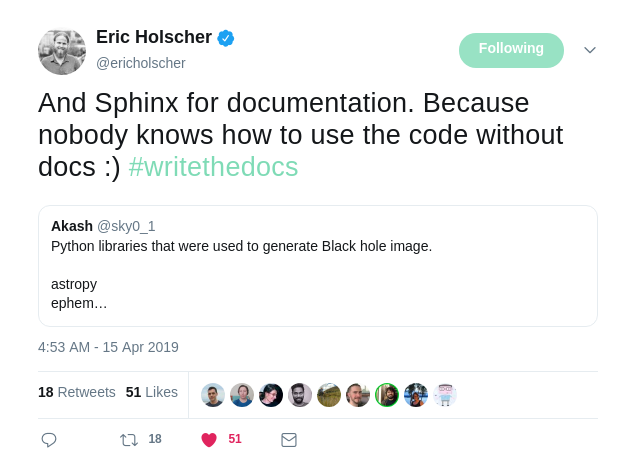

# <font color="green">`$ whoami`</font>

### Andrey (pronounced similar to André) Smelter
### Postdoctoral Scholar at the <font color='blue'>University of Kentucky Markey Cancer Center</font>

### Links:
* <i class="fa fa-github"></i>: [github.com/andreysmelter](https://github.com/andreysmelter)
* <i class="fa fa-linkedin"></i>: [linkedin.com/in/andreysmelter](https://www.linkedin.com/in/andreysmelter/)
* <i class="fa fa-instagram"></i>: [instagram.com/andreysmelter](https://www.instagram.com/andreysmelter/)
* <i class="fa fa-twitter"></i>: [twitter.com/smelandr](https://twitter.com/smelandr)


---
background-image: url(resources/pics/WriteTheDocs.jpg)

<div class="my-footer">
    <span>
        <a href="https://twitter.com/ThatDocsLady/status/1115921726297247744">
            [Ref]: https://twitter.com/ThatDocsLady/status/1115921726297247744
        </a>
    </span>
</div>

```{r setup, include=FALSE}
options(htmltools.dir.version = FALSE)
```


---
class: center, middle

## A regular slide with text or `code`.


---
class: inverse, center, middle

## A transition slide or terminal output.


<div class="my-footer">
    <span>
        <a href="">
            [Ref]: Click me!
        </a>
    </span>
</div>


---
class: center, middle

# Why write docs?

### You want <font color="green">people to use</font> your code

### You want your <font color="green">code to be better</font>

### You want <font color="green">contributors</font>

### You will be using <font color="green">your code in [X] months</font>


---
class: center, middle

# <font color="green">*To document or not to document?*</font>

> "There is a magical feeling that happens when you release your code. 
  It comes in a variety of ways, but it always hits you the same. 
  <font color="green">*Someone is using my code?!*</font> 
  A mix of terror and excitement."
  
<div class="my-footer">
    <span>
        <a href="https://www.writethedocs.org/guide/writing/beginners-guide-to-docs">
            [Ref]: https://www.writethedocs.org/guide/writing/beginners-guide-to-docs
        </a>
    </span>
</div>


---
class: inverse, center, top

background-image: url(resources/pics/MontyPythonAndTheHolyGrailNetflix.jpg)

# Get Started

### The Python Standard Library

<div class="my-footer">
    <span>
        <a href="https://www.netflix.com/title/771476">
            [Ref]: https://www.netflix.com/title/771476
        </a>
    </span>
</div>


---
class: center, middle

# <font color="green">"Batteries Included"</font> Philosophy

### Having a <font color="green">rich</font> and <font color="green">versatile</font> standard library

### Which is <font color="green">immediately available</font>

### <font color="green">Without</font> making the user <font color="green">download separate</font> packages

<div class="my-footer">
    <span>
        <a href="https://www.python.org/dev/peps/pep-0206">
            [Ref]: https://www.python.org/dev/peps/pep-0206
        </a>
    </span>
</div>


---
class: inverse, center, middle

# pydoc

### built-in


---
# pydoc

### The pydoc module <font color="green">automatically</font> generates documentation from Python modules.

### The documentation can be presented as:

* pages of <font color="green">**text on the console**</font>
* served to a <font color="green">**web browser**</font>
* or saved to <font color="green">**HTML files**</font>


<div class="my-footer">
    <span>
        <a href="https://docs.python.org/3/library/pydoc.html">
            [Ref]: https://docs.python.org/3/library/pydoc.html
        </a>
        &nbsp;&nbsp;&nbsp;&nbsp;&nbsp;&nbsp;&nbsp;&nbsp;&nbsp;&nbsp;&nbsp;&nbsp;&nbsp;&nbsp;&nbsp;&nbsp;
        <a href="https://github.com/python/cpython/blob/3.7/Lib/pydoc.py">
            [Ref]: https://github.com/python/cpython/blob/3.7/Lib/pydoc.py
        </a>
    </span>
</div>


---
# Let's use quadratic equation as an example

--

* The <font color="green">**quadratic equation**</font> formula: 

$$ax^2 + bx + c = 0$$

--
* The quadratic formula for the <font color="green">**roots**</font>: 

$$x_{1,2}=\frac{-b \pm \sqrt{b^2-4ac} }{2a}$$

--
* The <font color="green">`equations/quadratic.py`</font> module: 

```{python python.reticulate=FALSE}
import cmath


def quadratic(a, b, c):
    discriminant = cmath.sqrt(b**2.0 - 4.0 * a * c)
    x1 = (-b + discriminant) / (2.0 * a)
    x2 = (-b - discriminant) / (2.0 * a)
    return x1, x2
```

<div class="my-footer">
    <span>
        <a href="https://github.com/andreysmelter/talks/tree/master/2019-04-25-DerbyPy-DocumentingPythonPackages/examples/0_example">
            [Ref]: Example 0.
        </a>
    </span>
</div>


---
class: inverse

# pydoc

### The pydoc module <font color="green">"automatically"</font> generates documentation from Python modules

<pre class="remark-code">
<font color="green">$ python3 -m pydoc equations.quadratic</font>
Help on module quadratic:

NAME
    quadratic

FUNCTIONS
    quadratic(a, b, c)

FILE
    equations/quadratic.py
</pre>


---
# pydoc

* Add <font color="green">**module-level**</font> docstrig.
* Add <font color="green">**function-level**</font> docstring.


```{python python.reticulate=FALSE}
"""
This module contains routines for finding 
roots of quadratic equations.
"""

import cmath


def quadratic(a, b, c):
    """Solve quadratic equation."""
    discriminant = cmath.sqrt(b**2.0 - 4.0 * a * c)
    x1 = (-b + discriminant) / (2.0 * a)
    x2 = (-b - discriminant) / (2.0 * a)
    return x1, x2
```

<div class="my-footer">
    <span>
        <a href="https://github.com/andreysmelter/talks/tree/master/2019-04-25-DerbyPy-DocumentingPythonPackages/examples/1_example">
            [Ref]: Example 1.
        </a>
    </span>
</div>


---
class: inverse

# pydoc

### The pydoc module <font color="green">automatically</font> generates documentation from Python modules

<pre class="remark-code">
<font color="green">$ python3 -m pydoc equations.quadratic</font>
Help on module equations.quadratic in equations:

NAME
    equations.quadratic

DESCRIPTION
    <font color="yellow">This module contains routines for finding 
    roots of quadratic equations.</font>

FUNCTIONS
    quadratic(a, b, c)
        <font color="yellow">Solve quadratic equation.</font>

FILE
    equations/quadratic.py
</pre>

---
# pydoc

* <font color="green">**Package-level**</font> docstring?


---
class: inverse

# pydoc

<pre class="remark-code">
<font color="green">$ python3 -m pydoc equations</font>
Help on package equations:

NAME
    equations

PACKAGE CONTENTS
    quadratic

FILE
    (built-in)
</pre>


---
# pydoc

* Create <font color="green">`equations/__init__.py`</font> file.

```{python python.reticulate=FALSE}
"""
This package provides routines for solving
equations.
"""


__author__ = "Andrey Smelter"
__version__ = "0.1.0"
```

<div class="my-footer">
    <span>
        <a href="https://github.com/andreysmelter/talks/tree/master/2019-04-25-DerbyPy-DocumentingPythonPackages/examples/2_example">
            [Ref]: Example 2.
        </a>
    </span>
</div>


---
class: inverse

# pydoc

<pre class="remark-code">
<font color="green">$ python3 -m pydoc equations</font>
Help on package equations:

NAME
    equations

DESCRIPTION
    <font color="yellow">This package provides routines for solving
    equations.</font>

PACKAGE CONTENTS
    quadratic

VERSION
    <font color="yellow">0.1.0</font>

AUTHOR
    <font color="yellow">Andrey Smelter</font>

FILE
    equations/__init__.py
</pre>


---

# pydoc

* How about <font color="green">**static HTML**</font> pages?


---
class: inverse

# pydoc

* How about <font color="green">**static HTML**</font> pages?

<pre class="remark-code">
<font color="green">$ python3 -m pydoc -w equations</font>
<font color="green">$ python3 -m pydoc -w equations.quadratic</font>
</pre>

<div class="my-footer">
    <span>
        <a href="https://github.com/andreysmelter/talks/tree/master/2019-04-25-DerbyPy-DocumentingPythonPackages/examples/3_example">
            [Ref]: Example 3.
        </a>
    </span>
</div>


---

# pydoc

* <font color="green">**Package-level**</font> HTML doc:


---

# pydoc

* <font color="green">**Module-level**</font> HTML doc:


---

# pydoc

### Pros:
* <font color="green">**Built-in**</font> docs generator.
* Used by <font color="green">`>>> help()`</font> function to pull and display docstrings 
  from functions/methods, modules, and packages.

### Cons:
* Static HTML docs are very <font color="green">**retro style**</font>.


--


---
class: inverse, center, middle

# doctest

### built-in


---
# doctest

### Searches for pieces of text that <font color="green">look like interactive Python sessions</font>. 
### Then <font color="green">executes those sessions</font> to verify that they work exactly as shown.

<div class="my-footer">
    <span>
        <a href="https://docs.python.org/3/library/doctest.html">
            [Ref]: https://docs.python.org/3/library/doctest.html
        </a>
        &nbsp;&nbsp;&nbsp;&nbsp;&nbsp;&nbsp;&nbsp;&nbsp;&nbsp;&nbsp;&nbsp;&nbsp;&nbsp;&nbsp;&nbsp;&nbsp;
        <a href="https://github.com/python/cpython/blob/3.7/Lib/doctest.py">
            [Ref]: https://github.com/python/cpython/blob/3.7/Lib/doctest.py
        </a>
    </span>
</div>


---
# doctest

```{python python.reticulate=FALSE}
def quadratic(a, b, c):
    """Solve quadratic equation.

    {{For example:
    >>> x1, x2 = quadratic(a=2, b=-8, c=-24)
    >>> x1                                       
    (6+0j)
    >>> x2
    (-2+0j)
    >>> 2*x1**2 - 8*x1 - 24
    0j
    >>> 2*x2**2 - 8*x2 - 24
    0j}}
    """
    discriminant = cmath.sqrt(b**2.0 - 4.0 * a * c)
    x1 = (-b + discriminant) / (2.0 * a)
    x2 = (-b - discriminant) / (2.0 * a)
    return x1, x2

if __name__ == "__main__":
    import doctest
    print(doctest.testmod()) #<<
```

<div class="my-footer">
    <span>
        <a href="https://github.com/andreysmelter/talks/tree/master/2019-04-25-DerbyPy-DocumentingPythonPackages/examples/4_example/">
            [Ref]: Example 4.
        </a>
    </span>
</div>


---
class: inverse

# doctest

<pre class="remark-code">
<font color="green">$ python3 -m equations.quadratic</font>
TestResults(failed=0, attempted=5)
</pre>


---
class: inverse

# doctest

<pre class="remark-code small-55">
<font color="green">$ python3 -m equations.quadratic -v</font>
Trying:
    x1, x2 = quadratic(a=2, b=-8, c=-24)
Expecting nothing
<font color="yellow">ok</font>
Trying:
    x1
Expecting:
    (6+0j)
<font color="yellow">ok</font>
Trying:
    x2
Expecting:
    (-2+0j)
<font color="yellow">ok</font>
Trying:
    2*x1**2 - 8*x1 - 24
Expecting:
    0j
<font color="yellow">ok</font>
Trying:
    2*x2**2 - 8*x2 - 24
Expecting:
    0j
<font color="yellow">ok</font>
1 items had no tests:
    __main__
1 items passed all tests:
   5 tests in __main__.quadratic
5 tests in 2 items.
5 passed and 0 failed.
<font color="yellow">Test passed.
TestResults(failed=0, attempted=5)</font>
</pre>


---
# doctest

```{python python.reticulate=FALSE}
def quadratic(a, b, c):
    """Solve quadratic equation.

    For example:
    >>> x1, x2 = quadratic(a=2, b=-8, c=-24)
    >>> x1  #<<
    (8+0j)  #<<
    >>> x2
    (-2+0j)
    >>> 2*x1**2 - 8*x1 - 24
    0j
    >>> 2*x2**2 - 8*x2 - 24
    0j
    """
    discriminant = cmath.sqrt(b**2.0 - 4.0 * a * c)
    x1 = (-b + discriminant) / (2.0 * a)
    x2 = (-b - discriminant) / (2.0 * a)
    return x1, x2

if __name__ == "__main__":
    import doctest
    print(doctest.testmod())
```

<div class="my-footer">
    <span>
        <a href="https://github.com/andreysmelter/talks/tree/master/2019-04-25-DerbyPy-DocumentingPythonPackages/examples/5_example/">
            [Ref]: Example 5.
        </a>
    </span>
</div>


---
class: inverse

# doctest

<pre class="remark-code">
<font color="green">$ python3 -m equations.quadratic</font>
======================================================================
File "equations/quadratic.py", line 14, in __main__.quadratic
Failed example:
    x1
<font color="yellow">Expected:
    (8+0j)
Got:
    (6+0j)</font>
======================================================================
1 items had failures:
   1 of   5 in __main__.quadratic
<font color="yellow">Test Failed 1 failures.
TestResults(failed=1, attempted=5)</font>
</pre>


---
# doctest

```{python python.reticulate=FALSE, eval=FALSE}
def quadratic(a, b, c):
    """Solve quadratic equation.

    For example:
    >>> x1, x2 = quadratic(a=0, b=-8, c=-24)  #<<
    """
    discriminant = cmath.sqrt(b**2.0 - 4.0 * a * c)
    x1 = (-b + discriminant) / (2.0 * a)
    x2 = (-b - discriminant) / (2.0 * a)
    return x1, x2


if __name__ == "__main__":
    import doctest
    print(doctest.testmod())
```

<div class="my-footer">
    <span>
        <a href="https://github.com/andreysmelter/talks/tree/master/2019-04-25-DerbyPy-DocumentingPythonPackages/examples/6_example/">
            [Ref]: Example 6.
        </a>
    </span>
</div>


---
class: inverse

# doctest

<pre class="remark-code">
<font color="green">$ python3 -m equations.quadratic</font>
======================================================================
File "equations/quadratic.py", line 13, in __main__.quadratic
Failed example:
    x1, x2 = quadratic(a=0, b=-8, c=-24)
<font color="yellow">Exception raised:</font>
    Traceback (most recent call last):
      File "/usr/lib64/python3.5/doctest.py", line 1321, in __run
        compileflags, 1), test.globs)
      File "<doctest __main__.quadratic[0]>", line 1, in <module>
        x1, x2 = quadratic(a=0, b=-8, c=-24)
      File "equations/quadratic.py", line 16, in quadratic
        x1 = (-b + discriminant) / (2.0 * a)
    <font color="yellow">ZeroDivisionError: complex division by zero</font>
======================================================================
1 items had failures:
   1 of   1 in __main__.quadratic
Test Failed 1 failures.
TestResults(failed=1, attempted=1)
</pre>


---
# doctest

```{python python.reticulate=FALSE, eval=FALSE}
def quadratic(a, b, c):
    """Solve quadratic equation.

    For example:
    >>> x1, x2 = quadratic(a=0, b=-8, c=-24)
    Traceback (most recent call last):  #<<
    ...                                 #<<
    ZeroDivisionError: complex division by zero  #<<
    """
    discriminant = cmath.sqrt(b**2.0 - 4.0 * a * c)
    x1 = (-b + discriminant) / (2.0 * a)
    x2 = (-b - discriminant) / (2.0 * a)
    return x1, x2


if __name__ == "__main__":
    import doctest
    print(doctest.testmod())
```

<div class="my-footer">
    <span>
        <a href="https://github.com/andreysmelter/talks/tree/master/2019-04-25-DerbyPy-DocumentingPythonPackages/examples/7_example/">
            [Ref]: Example 7.
        </a>
    </span>
</div>


---
class: inverse

# doctest

<pre class="remark-code">
<font color="green">$ python3 -m equations.quadratic -v</font>
Trying:
    x1, x2 = quadratic(a=0, b=-8, c=-24)
Expecting:
    Traceback (most recent call last):
    ...
    ZeroDivisionError: complex division by zero
<font color="yellow">ok</font>
1 items had no tests:
    __main__
1 items passed all tests:
   1 tests in __main__.quadratic
1 tests in 2 items.
1 passed and 0 failed.
<font color="yellow">Test passed.
TestResults(failed=0, attempted=1)</font>
</pre>


---
# doctest

### Pros:
* <font color="green">**Built-in**</font> docs string test.
* Forces you to write <font color="green">**high-quality examples**</font> in your doc strings.
* Makes sure that your doc string is <font color="green">**up-to-date**</font>.

### Cons:
* May not be useful for more <font color="green">**complex cases**</font>.

<div class="my-footer">
    <span>
        <a href="https://github.com/scikit-learn/scikit-learn/blob/master/sklearn/linear_model/bayes.py#L113">
            [Ref]: doctest example from scikit-learn machine learning library.
        </a>
    </span>
</div>


---
class: inverse, center, bottom

background-image: url(resources/pics/CheeseShop.png)

# a.k.a. Python Package Index (PyPI)

<div class="my-footer">
    <span>
        <a href="https://wiki.python.org/moin/CheeseShop">
            [Ref]: https://wiki.python.org/moin/CheeseShop
        </a>
        &nbsp;&nbsp;&nbsp;&nbsp;&nbsp;&nbsp;&nbsp;&nbsp;&nbsp;&nbsp;&nbsp;&nbsp;&nbsp;&nbsp;&nbsp;&nbsp;
        <a href="https://youtu.be/uT3OQECSDoQ">
            [Ref]: https://youtu.be/uT3OQECSDoQ
        </a>
    </span>
</div>


---
class: inverse, center, middle

# Sphinx

### python3 -m pip install Sphinx


---
# Sphinx

### Makes it easy to create <font color="green">beatiful documentation</font> for Python projects.
### Uses <font color="green">reStructuredText</font> as its markup language format.

<div class="my-footer">
    <span>
        <a href="https://pypi.org/project/Sphinx">
            [Ref]: https://pypi.org/project/Sphinx
        </a>
        &nbsp;&nbsp;&nbsp;&nbsp;&nbsp;&nbsp;&nbsp;&nbsp;&nbsp;&nbsp;&nbsp;&nbsp;&nbsp;
        <a href="https://github.com/sphinx-doc/sphinx">
            [Ref]: https://github.com/sphinx-doc/sphinx
        </a>
        &nbsp;&nbsp;&nbsp;&nbsp;&nbsp;&nbsp;&nbsp;&nbsp;&nbsp;&nbsp;&nbsp;&nbsp;&nbsp;
        <a href="http://www.sphinx-doc.org/en/master">
            [Ref]: http://www.sphinx-doc.org/en/master
        </a>
    </span>
</div>


---
class: inverse

# Sphinx: `sphinx-quickstart`

```
$ mkdir docs && cd docs
$ sphinx-quickstart
```
--
```
> Separate source and build directories (y/n) [n]:
The project name will occur in several places in the built documentation.
> Project name: equations
> Author name(s): Andrey Smelter
> Project release []: 0.1.0
> Project language [en]: 
```

--
```
Creating file ./conf.py.
Creating file ./index.rst.
Creating file ./Makefile.
Creating file ./make.bat.

Finished: An initial directory structure has been created.
You should now populate your master file ./index.rst and 
create other documentation source files. Use the Makefile 
to build the docs, like so:
   make builder
where "builder" is one of the supported builders, 
e.g. html, latex or linkcheck.
```

<div class="my-footer">
    <span>
        <a href="https://github.com/andreysmelter/talks/tree/master/2019-04-25-DerbyPy-DocumentingPythonPackages/examples/8_example/">
            [Ref]: Example 8.
        </a>
    </span>
</div>


---
class: inverse

# Sphinx: `sphinx-quickstart`

<pre class="remark-code">
<font color="green">$ tree docs</font>
.
├── docs
│   ├── _build
│   ├── <font color="yellow">conf.py</font>
│   ├── <font color="yellow">index.rst</font>
│   ├── make.bat
│   ├── <font color="yellow">Makefile</font>
│   ├── _static
│   └── _templates
└── equations
    ├── __init__.py
    └── quadratic.py
</pre>

<div class="my-footer">
    <span>
        <a href="https://github.com/andreysmelter/talks/tree/master/2019-04-25-DerbyPy-DocumentingPythonPackages/examples/8_example/">
            [Ref]: Example 8.
        </a>
    </span>
</div>


---
# Sphinx: `conf.py`

```{python python.reticulate=FALSE, eval=FALSE}
# import os
# import sys
# sys.path.insert(0, os.path.abspath('.'))

project = 'equations'
copyright = '2019, Andrey Smelter'
author = 'Andrey Smelter'

release = '0.1.0'

extensions = [
]

templates_path = ['_templates']

html_theme = 'alabaster'

html_static_path = ['_static']
```

<div class="my-footer">
    <span>
        <a href="https://github.com/andreysmelter/talks/tree/master/2019-04-25-DerbyPy-DocumentingPythonPackages/examples/8_example/">
            [Ref]: Example 8.
        </a>
    </span>
</div>


---
# Sphinx: `index.rst`

```{rst eval=FALSE}
Welcome to equations's documentation!
=====================================

.. toctree::
   :maxdepth: 2
   :caption: Contents:
```

<div class="my-footer">
    <span>
        <a href="https://github.com/andreysmelter/talks/tree/master/2019-04-25-DerbyPy-DocumentingPythonPackages/examples/8_example/">
            [Ref]: Example 8.
        </a>
    </span>
</div>


---
# Sphinx: `index.rst`

```{rst eval=FALSE}
Welcome to equations's documentation!
=====================================

{{The library for solving equations.

.. note::
    
    The ``equations`` library currently can only solve 
    quadratic equations.}}

.. toctree::
   :maxdepth: 2
   :caption: Contents:
```

<div class="my-footer">
    <span>
        <a href="https://github.com/andreysmelter/talks/tree/master/2019-04-25-DerbyPy-DocumentingPythonPackages/examples/8_example/">
            [Ref]: Example 8.
        </a>
    </span>
</div>


---
class: inverse

# Sphinx: `Makefile`

<pre class="remark-code">
<font color="green">$ make html</font>
Running Sphinx v2.0.1
making output directory... done
building [mo]: targets for 0 po files that are out of date
building [html]: targets for 1 source files that are out of date
updating environment: 1 added, 0 changed, 0 removed
reading sources... [100%] index                                                                                                                                                                                    
looking for now-outdated files... none found
pickling environment... done
checking consistency... done
preparing documents... done
writing output... [100%] index                                                                                                                                                                                     
generating indices... genindex
writing additional pages... search
copying static files... done
copying extra files... done
dumping search index in English (code: en) ... done
dumping object inventory... done
build succeeded.

<font color="yellow">The HTML pages are in _build/html.</font>
</pre>

<div class="my-footer">
    <span>
        <a href="https://github.com/andreysmelter/talks/tree/master/2019-04-25-DerbyPy-DocumentingPythonPackages/examples/8_example/">
            [Ref]: Example 8.
        </a>
    </span>
</div>


---
# Sphinx: html docs


<div class="my-footer">
    <span>
        <a href="https://github.com/andreysmelter/talks/tree/master/2019-04-25-DerbyPy-DocumentingPythonPackages/examples/8_example/">
            [Ref]: Example 8.
        </a>
    </span>
</div>


---
# Sphinx: write doc string in reStructuredText format

```{python python.reticulate=FALSE, eval=FALSE}
def quadratic(a, b, c):
    """Solve quadratic equation.
    
    :param float a: a coefficient of a quadratic equation.  #<<
    :param float b: b coefficient of a quadratic equation.  #<<
    :param float c: c coefficient of a quadratic equation.  #<<
    :return: quadratic equation roots.                      #<< 
    :rtype: :py:class:`tuple`.                              #<<
    """
    discriminant = cmath.sqrt(b**2.0 - 4.0 * a * c)
    x1 = (-b + discriminant) / (2.0 * a)
    x2 = (-b - discriminant) / (2.0 * a)
    return x1, x2
```

<div class="my-footer">
    <span>
        <a href="https://github.com/andreysmelter/talks/tree/master/2019-04-25-DerbyPy-DocumentingPythonPackages/examples/9_example/">
            [Ref]: Example 9.
        </a>
    </span>
</div>


---
# Sphinx: enable `autodoc` extension in `conf.py`

```{python python.reticulate=FALSE, eval=FALSE}
import os  #<<
import sys #<<
sys.path.insert(0, os.path.abspath('..'))  #<<

project = 'equations'
copyright = '2019, Andrey Smelter'
author = 'Andrey Smelter'
release = '0.1.0'
extensions = [
    'sphinx.ext.autodoc',    #<<
    'sphinx.ext.viewcode',   #<<
    'sphinx.ext.intersphinx' #<<
]

intersphinx_mapping = {'python':('https://docs.python.org/3',None)}  #<<
templates_path = ['_templates']
html_theme = 'alabaster'
html_static_path = ['_static']
```

<div class="my-footer">
    <span>
        <a href="https://github.com/andreysmelter/talks/tree/master/2019-04-25-DerbyPy-DocumentingPythonPackages/examples/9_example/">
            [Ref]: Example 9.
        </a>
    </span>
</div>


---
# Sphinx: add `api.rst` file

```{rst eval=FALSE}
The equations API Reference
===========================

{{.. automodule:: equations

.. automodule:: equations.quadratic
    :members:}}
```

<div class="my-footer">
    <span>
        <a href="https://github.com/andreysmelter/talks/tree/master/2019-04-25-DerbyPy-DocumentingPythonPackages/examples/9_example/">
            [Ref]: Example 9.
        </a>
    </span>
</div>


---
# Sphinx: add `api.rst` to topic tree

```{rst eval=FALSE}
Welcome to equations's documentation!
=====================================

The library for solving equations.

.. note::
    
    The ``equations`` library currently can only solve 
    quadratic equations.

.. toctree::
   :maxdepth: 2
   :caption: Contents:
   
   api #<<
```

<div class="my-footer">
    <span>
        <a href="https://github.com/andreysmelter/talks/tree/master/2019-04-25-DerbyPy-DocumentingPythonPackages/examples/9_example/">
            [Ref]: Example 9.
        </a>
    </span>
</div>


---
# Sphinx: html docs


<div class="my-footer">
    <span>
        <a href="https://github.com/andreysmelter/talks/tree/master/2019-04-25-DerbyPy-DocumentingPythonPackages/examples/9_example/">
            [Ref]: Example 9.
        </a>
    </span>
</div>


---
# Sphinx: html docs


<div class="my-footer">
    <span>
        <a href="https://github.com/andreysmelter/talks/tree/master/2019-04-25-DerbyPy-DocumentingPythonPackages/examples/9_example/">
            [Ref]: Example 9.
        </a>
    </span>
</div>


---
# Sphinx: useful extensions

```{python python.reticulate=FALSE, eval=FALSE}
extensions = [
    'sphinx.ext.autodoc',
    'sphinx.ext.doctest',
    'sphinx.ext.todo',
    'sphinx.ext.coverage',
    'sphinx.ext.mathjax',
    'sphinx.ext.viewcode',
    'sphinx.ext.intersphinx',
    'nbsphinx'
]
```


---
# Sphinx: host on readthedocs.org

* <font color="green">**Register**</font> an account on readthedocs.org.
* <font color="green">**Point**</font> readthedocs to your <font color="green">**GitHub repo**</font>.
* Add path to <font color="green">`requirements.txt`</font> file under advanced settings.
* Push <font color="green">**commit to**</font> trigger documentaion <font color="green">**build**</font>.

--


---
# Sphinx

### Pros:

* Creates <font color="green">**beatiful**</font> docs.
* Provides useful <font color="green">**extensions**</font>.
* <font color="green">**Customizable**</font> (templates and themes).
* Uses <font color="green">**reStructuredText**</font>.

### Cons:

* Uses <font color="green">**reStructuredText**</font> (not really cons).


---
class: inverse, center, middle

# MkDocs

### python3 -m pip install mkdocs


---
# MkDocs

### MkDocs is a <font color="green">fast</font>, <font color="green">simple</font> and <font color="green">beautiful</font> static site generator for building project documentation.

### Uses <font color="green">Markdown</font> as its markup language format.


<div class="my-footer">
    <span>
        <a href="https://pypi.org/project/mkdocs">
            [Ref]: https://pypi.org/project/mkdocs
        </a>
        &nbsp;&nbsp;&nbsp;&nbsp;&nbsp;&nbsp;&nbsp;&nbsp;&nbsp;&nbsp;&nbsp;&nbsp;&nbsp;
        <a href="https://github.com/mkdocs/mkdocs">
            [Ref]: https://github.com/mkdocs/mkdocs
        </a>
        &nbsp;&nbsp;&nbsp;&nbsp;&nbsp;&nbsp;&nbsp;&nbsp;&nbsp;&nbsp;&nbsp;&nbsp;&nbsp;
        <a href="https://www.mkdocs.org">
            [Ref]: https://www.mkdocs.org/
        </a>
    </span>
</div>


---
class: inverse

# MkDocs: quickstart

<pre class="remark-code">
<font color="green">$ mkdocs new equations</font>
<font color="green">$ tree equations</font>
├── docs
│   └── <font color="yellow">index.md</font>
├── equations
│   ├── __init__.py
│   └── quadratic.py
└── <font color="yellow">mkdocs.yml</font>
</pre>

<div class="my-footer">
    <span>
        <a href="https://github.com/andreysmelter/talks/tree/master/2019-04-25-DerbyPy-DocumentingPythonPackages/examples/10_example/">
            [Ref]: Example 10.
        </a>
    </span>
</div>


---
# MkDocs: `mkdocs.yml`

```{yaml}
site_name: equations documentation!
```

<div class="my-footer">
    <span>
        <a href="https://github.com/mkdocs/mkdocs/blob/master/mkdocs.yml">
            [Ref]: See more complex mkdocs.yml - https://github.com/mkdocs/mkdocs/blob/master/mkdocs.yml
        </a>
    </span>
</div>


---
# MkDocs: `docs/index.md`

```{md}
# Welcome to `equations` documentation!

The library for solving equations.


### Note

The ``equations`` library currently can only solve 
quadratic equations.
```

<div class="my-footer">
    <span>
        <a href="https://github.com/andreysmelter/talks/tree/master/2019-04-25-DerbyPy-DocumentingPythonPackages/examples/10_example/">
            [Ref]: Example 10.
        </a>
    </span>
</div>


---
class: inverse

# MkDocs: html docs

<pre class="remark-code">
<font color="green">$ mkdocs serve</font>
INFO    -  Building documentation... 
INFO    -  Cleaning site directory 
[I 190425 02:27:22 server:298] Serving on http://127.0.0.1:8000
[I 190425 02:27:22 handlers:59] Start watching changes
[I 190425 02:27:22 handlers:61] Start detecting changes
</pre>

<div class="my-footer">
    <span>
        <a href="https://github.com/andreysmelter/talks/tree/master/2019-04-25-DerbyPy-DocumentingPythonPackages/examples/10_example/">
            [Ref]: Example 10.
        </a>
    </span>
</div>


---
# MkDocs: html docs


<div class="my-footer">
    <span>
        <a href="https://github.com/andreysmelter/talks/tree/master/2019-04-25-DerbyPy-DocumentingPythonPackages/examples/10_example/">
            [Ref]: Example 10.
        </a>
    </span>
</div>


---
# MkDocs

### Pros:

* <font color="green">**Lowers**</font> the <font color="green">**barrier**</font> for writing docs.
* Focuses on <font color="green">**high quality prose**</font> docs.
* Creates <font color="green">**beatiful**</font> docs.
* <font color="green">**Customizable**</font> themes based on Bootstrap.
* Uses <font color="green">**Markdown**</font>.

### Cons:

* Cannot automatically pull <font color="green">**API docs**</font>.


---
# Conclusion: \#<font color="green">write</font>the<font color="green">docs</font>



